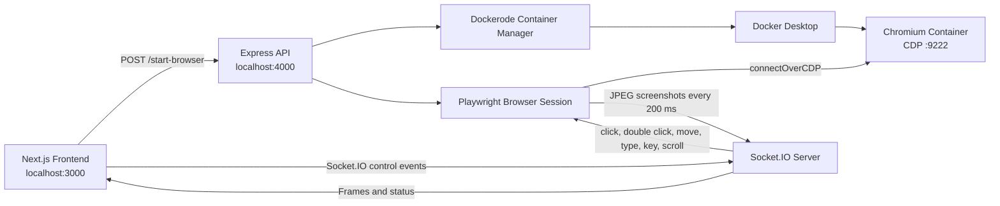

# Architecture Diagram

## Components

- **Frontend:** Shows status, renders frames, captures pointer, keyboard, and scroll events.
- **Backend API:** Starts/stops the browser container and reports status.
- **Socket.IO:** Carries compressed screenshot frames and browser control events.
- **Dockerode:** Builds the local Docker image and manages the Chromium container.
- **Playwright:** Connects to Chromium over CDP and applies user controls.

